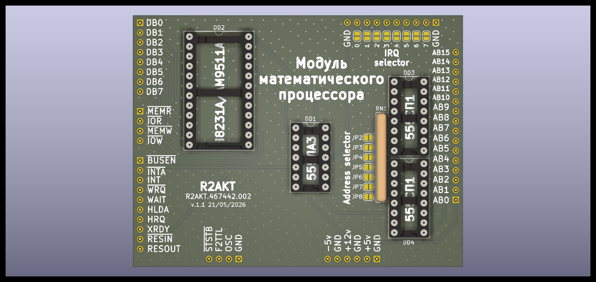

License addendum - https://github.com/R2AKT/APU9511/blob/main/Addendum.txt
# APU9511

APU (Arithmetic Processing Unit) module for CPU_8080 board based on AM9511/8231.
For Mega-80 (Mega-580) DIY 8-bit micro-computer - https://github.com/R2AKT/Mega-80.

*Note: The processor module CPU_8080 must use a 580VK38 (8238) system bus controller, which is not functional when using 580VK28 (8228).

Status: tested.

Модуль математического процессора на базе AM9511/8231.
Для самодельной 8-битной микро-ЭВМ - https://github.com/R2AKT/Mega-80.

*Примечание: в процессорном модуле CPU_8080 должен применяться контроллер системной шины 580ВК38 (8238), при использовании 580ВК28 (8228) не работоспособно.

Статус: проверено.
